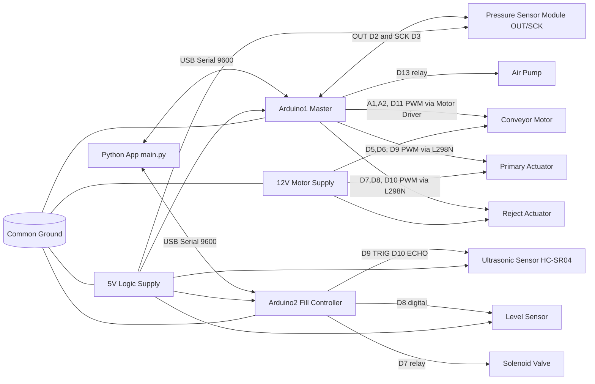
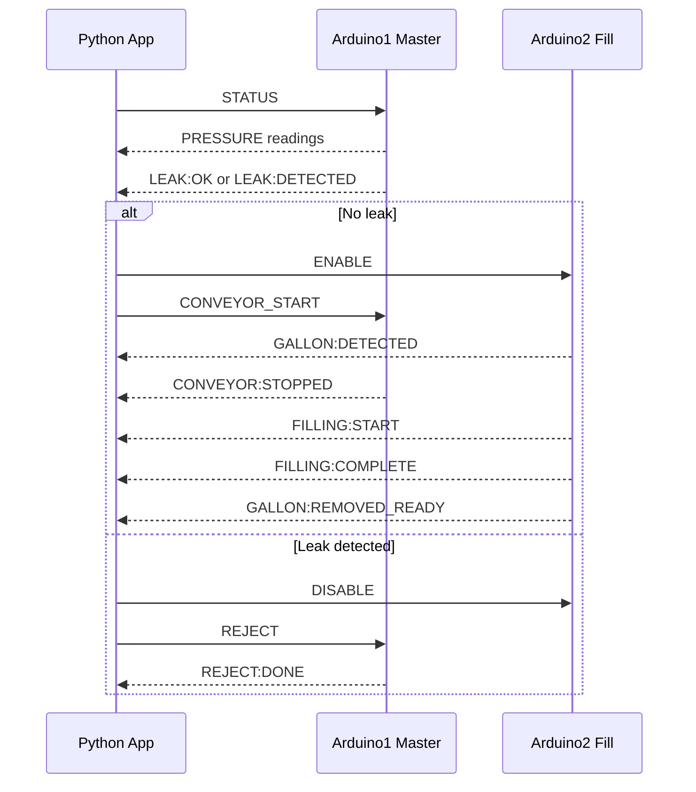

# Automated Refill System Hardware Schematic

This schematic is based on the active pin constants in:
- automated_refill_system.ino (Arduino1, master)
- solenoid_valve_arduino.ino (Arduino2, fill controller)

## 1) System Block Diagram

## 2) Arduino1 Master Pin Map

| Function | Module | Arduino1 Pin |
|---|---|---|
| Pressure data | Pressure sensor OUT | D2 |
| Pressure clock | Pressure sensor SCK | D3 |
| Conveyor IN1 | Conveyor driver | A1 |
| Conveyor IN2 | Conveyor driver | A2 |
| Conveyor ENA PWM | Conveyor driver | D11 |
| Primary actuator IN1 | L298N | D5 |
| Primary actuator IN2 | L298N | D6 |
| Primary actuator ENA PWM | L298N | D9 |
| Reject actuator IN1 | L298N | D7 |
| Reject actuator IN2 | L298N | D8 |
| Reject actuator ENA PWM | L298N | D10 |
| Air pump relay control | Relay module | D13 |

## 3) Arduino2 Fill Controller Pin Map

| Function | Module | Arduino2 Pin |
|---|---|---|
| Ultrasonic TRIG | HC-SR04 | D9 |
| Ultrasonic ECHO | HC-SR04 | D10 |
| Solenoid relay control | Relay module | D7 |
| Level sensor input | Water level sensor | D8 |

## 4) Wiring Notes

- Keep all grounds common: Arduino1 GND, Arduino2 GND, relay GND, motor driver GND, sensor GND, and power supply GND must be tied together.
- Do not power motors from Arduino 5V. Use external 12V for conveyor/actuators through motor drivers.
- Relay modules for pump and solenoid are usually active LOW. Verify before live testing.
- Use flyback protection and proper relay/motor driver modules for inductive loads.
- Start with actuators disconnected from mechanical load during first firmware test.

## 5) Control Signal Flow

